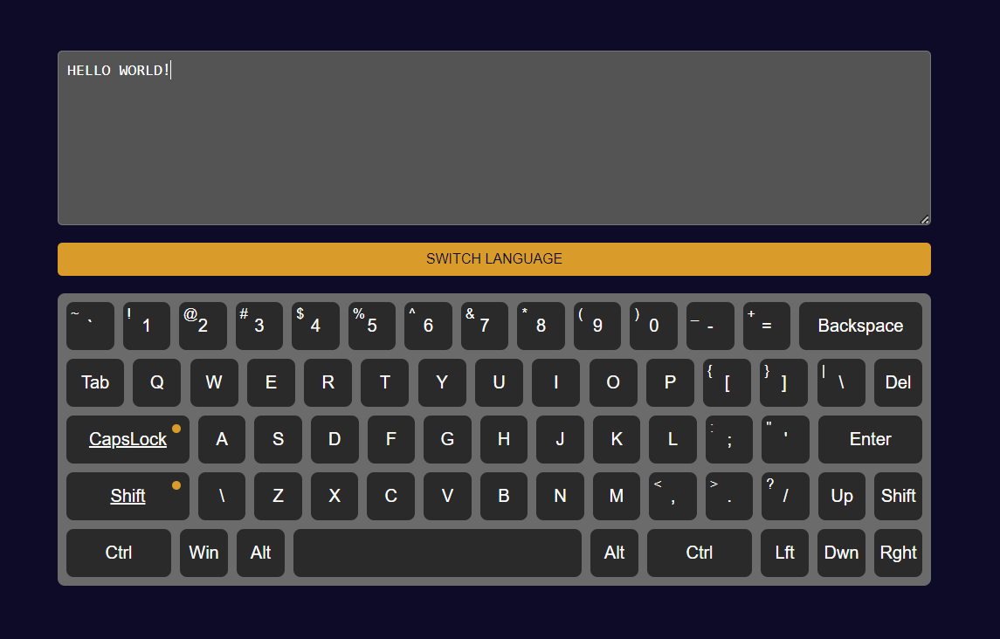

# virtual-keyboard

A vanilla JS challenge. The virtual keyboard depeloped with native JS (OOP). The tech stack is: JS, SCSS, Webpack.

### To start this app you will need to:

- **git clone ...** clone the repo into your PC
- **npm i** to install all the required dependencies
- npm run dev to launch the app runtime

